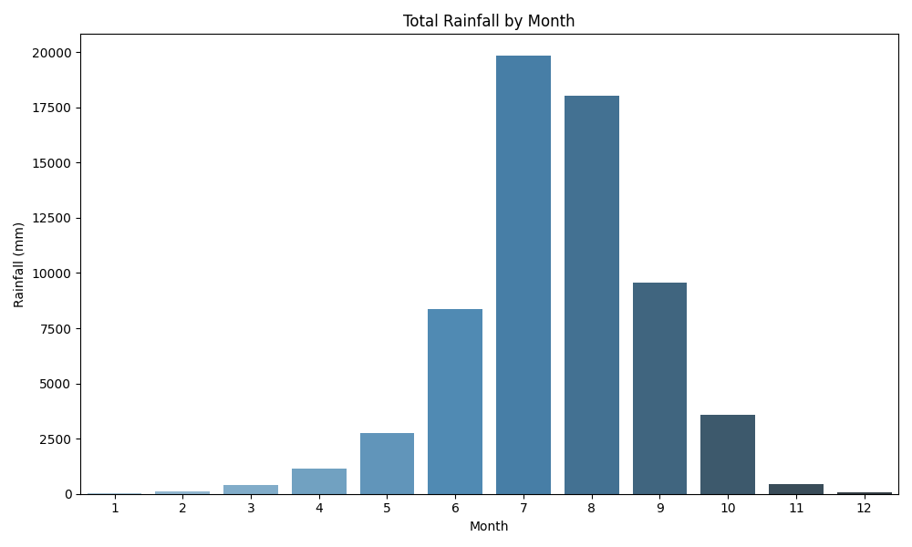
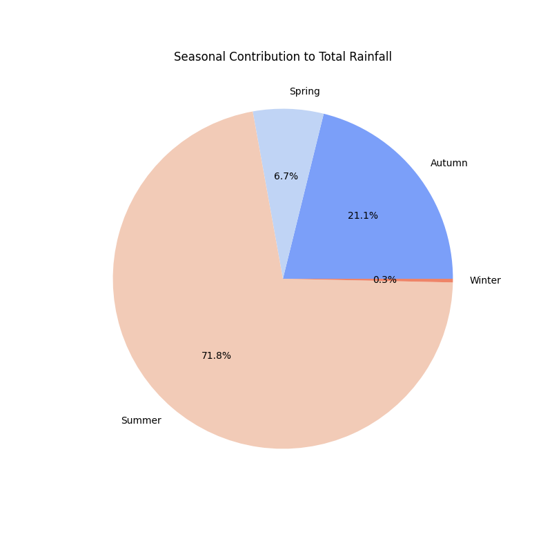
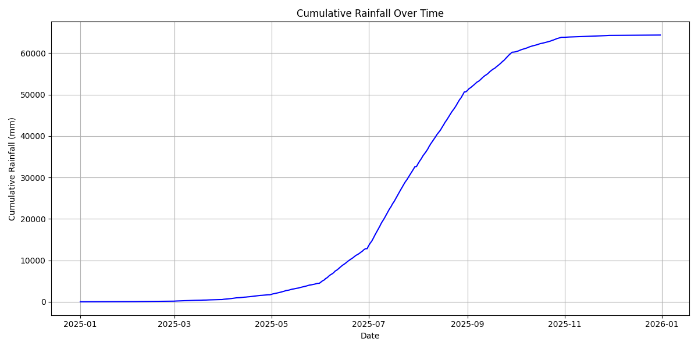

# Rainfall Harvesting Potential Analysis

This project calculates and visualizes the potential for rainwater harvesting in urban areas. By analyzing rainfall data and rooftop areas, it provides detailed insights into rainwater collection potential, seasonal contributions, and efficiency simulations at varying runoff coefficients.

---

## Features

- **Rainfall Data Analysis**:
  - Monthly and seasonal rainfall trends.
  - Cumulative rainfall visualization.
  - Rainfall distribution with outliers highlighted.

- **Rainwater Harvesting Potential**:
  - Calculates total water collection potential for buildings.
  - Identifies top buildings by collection potential.

- **Efficiency Simulations**:
  - Compares water collection potential across different runoff coefficients.

- **Comprehensive Visualizations**:
  - Bar plots, pie charts, histograms, and cumulative trends.
  - Outputs stored in a structured directory.

---

## Project Structure

```
Rainfall-Analysis/
│
├── rainfall_analysis.py      # Main script for analysis and visualizations
├── data/
│   ├── Building_Rooftop_Area_Data.csv   # Rooftop data (input file)
│   ├── Precipitation_Data.csv           # Rainfall data (input file)
├── plots/                    # Directory for saved visualizations
│   ├── monthly_rainfall.png
│   ├── seasonal_contribution.png
│   ├── cumulative_rainfall.png
│   ├── efficiency_simulation.png
│   ├── rainfall_distribution.png
│   ├── rainfall_boxplot.png
│   ├── top_buildings.png
├── rainwater_potential.csv   # Building-wise rainwater potential (output)
├── daily_rainfall.csv        # Daily rainfall and trends (output)
├── README.md                 # Project documentation
```

---

## Input Data

1. **Building Rooftop Area Data**:
   - File: `Building_Rooftop_Area_Data.csv`
   - Columns:
     - `Building ID`: Unique identifier for each building.
     - `Rooftop Area (m²)`: Area of the rooftop in square meters.

2. **Precipitation Data**:
   - File: `Precipitation_Data.csv`
   - Columns:
     - `DateTime`: Date and time of rainfall.
     - `Rainfall (mm/hr)`: Rainfall intensity in millimeters per hour.

---

## Installation

### Prerequisites
- Python 3.8 or later
- Required libraries: `pandas`, `matplotlib`, `seaborn`, `numpy`

### Steps
1. Clone the repository:
   ```bash
   git clone https://github.com/bibeksubedi0001/rainfall-harvesting.git
   cd rainfall-analysis
   ```

2. Install dependencies:
   ```bash
   pip install -r requirements.txt
   ```

3. Add your input data files (`Building_Rooftop_Area_Data.csv`, `Precipitation_Data.csv`) to the `data/` directory.

4. Run the script:
   ```bash
   python rainfall_analysis.py
   ```

---

## Outputs

### Visualizations
- **Monthly Rainfall Trends**: `monthly_rainfall.png`
- **Seasonal Contribution to Rainfall**: `seasonal_contribution.png`
- **Cumulative Rainfall Trends**: `cumulative_rainfall.png`
- **Rainfall Distribution**:
  - Histogram: `rainfall_distribution.png`
  - Boxplot: `rainfall_boxplot.png`
- **Efficiency Simulations**: `efficiency_simulation.png`
- **Top Buildings by Collection Potential**: `top_buildings.png`

### Data Files
- `rainwater_potential.csv`: Total rainwater harvesting potential for each building.
- `daily_rainfall.csv`: Daily rainfall data with cumulative trends and seasonal classifications.

---

## How It Works

1. **Data Aggregation**:
   - Rainfall data is aggregated into daily, monthly, and seasonal totals.

2. **Rainwater Potential Calculation**:
   - Uses the formula:
     ```
     Water Collection (L) = Rainfall (mm) × Rooftop Area (m²) × Runoff Coefficient
     ```
   - Default runoff coefficient is `0.9`.

3. **Efficiency Simulation**:
   - Simulates water collection at coefficients: `0.9`, `0.8`, `0.7`, `0.6`.

4. **Visualization**:
   - Generates plots to uncover trends and actionable insights.

---

## Example Visualizations

### Monthly Rainfall Trends


### Seasonal Contribution


### Cumulative Rainfall


---

## Contact

For questions or suggestions, feel free to reach out:

- **Email**: 078bce035.bibek@pcampus.edu
- **GitHub**: https://github.com/bibeksubedi0001/Rainfall-Harvesting
